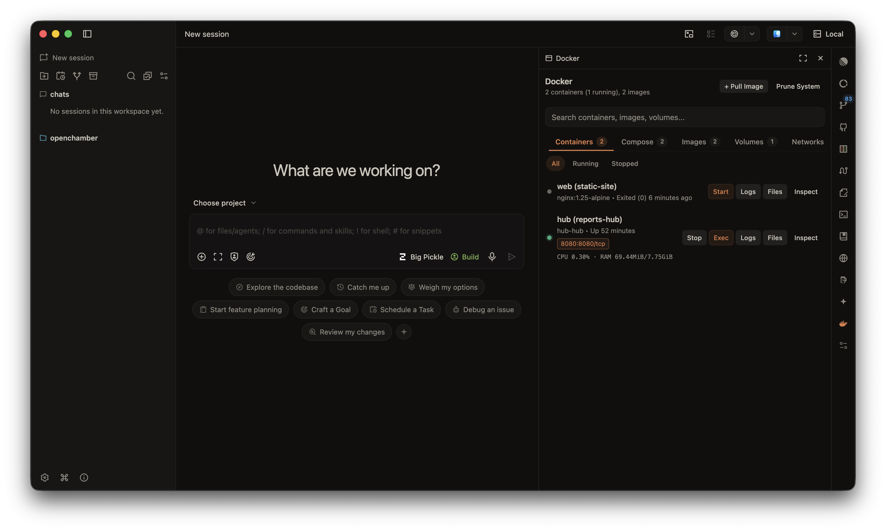
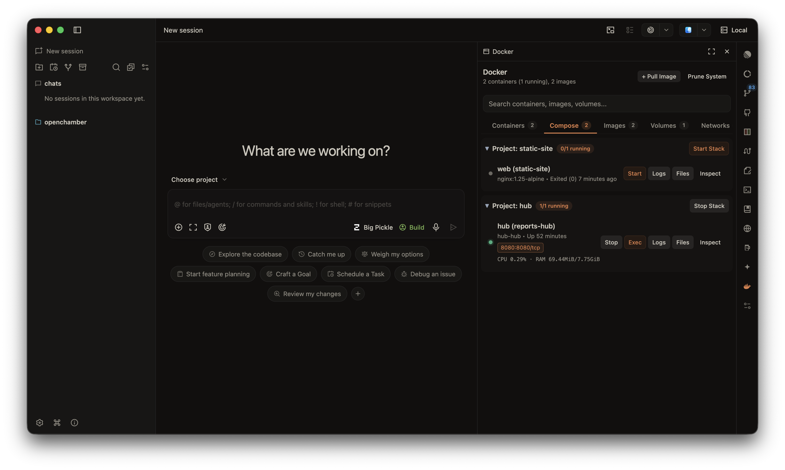
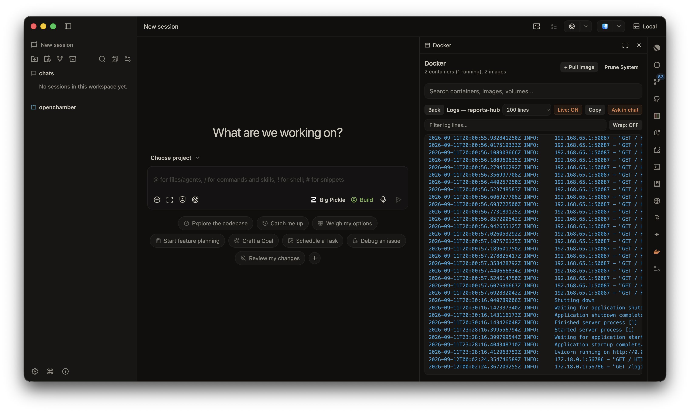
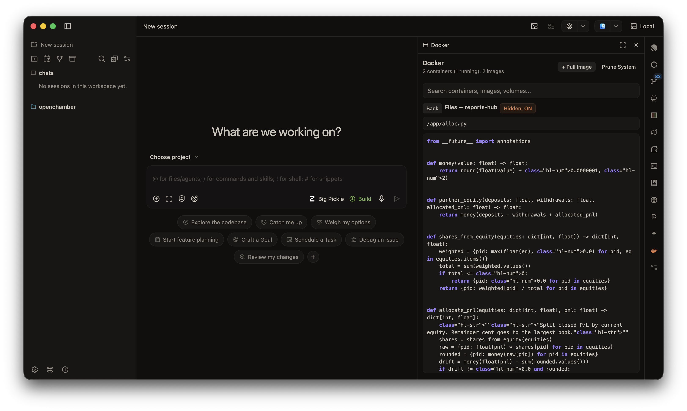
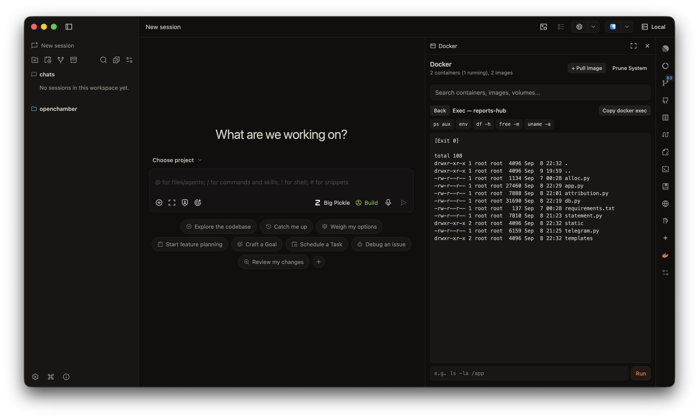

# Docker extension for OpenChamber

A comprehensive OpenChamber GUI panel to inspect and manage Docker containers, Docker Compose stacks, images, volumes, networks, and system storage.

It shells out to the `docker` binary on PATH using host execution permissions (`permissions.exec`).

## Features

### Containers & Docker Compose
- **Container Lifecycle Management**: Start, stop, restart, pause, unpause, and force-remove containers.
- **Compose Project Grouping**: Automatic visual grouping of containers by Docker Compose project with project-level batch controls (start, stop, restart project).
- **Live Resource Usage**: Compact real-time CPU and RAM metrics for running containers (e.g. `CPU 1.2% · RAM 185MB`).
- **Port Forwarding**: One-click opening of exposed container host ports.
- **Multi-Select & Bulk Actions**: Select multiple containers for simultaneous start, stop, restart, or removal operations.
- **Status Filters**: Quick filtering by `All`, `Running`, or `Stopped` status.

### Inspection & Debugging
- **Real-Time Logs Viewer**: Stream container logs with syntax highlighting for log levels (INFO, WARN, ERR, timestamps, JSON keys), search filtering, line wrapping, line numbers, and auto-scroll toggles.
- **Interactive Container Shell Exec**: Execute custom shell commands (`sh`, `bash`, `ls`, `env`, etc.) inside running containers with preset quick shortcuts and output history.
- **Container File System Browser**: Explore container directory trees, list file permissions and sizes, and preview text file contents directly inside the panel.
- **Resource Inspector**: Searchable JSON and key-value metadata view for inspect objects across containers, images, volumes, and networks.

### Storage & System Management
- **Image Management**: View local images with repository tags, IDs, size, and creation date, with support for deleting dangling or unused images.
- **Volume Management**: List Docker volumes, driver details, and prune unused storage volumes.
- **Network Inspector**: Browse Docker networks (bridge, host, overlay, macvlan), view network drivers, scopes, and attached containers.
- **System Usage Dashboard**: View overall Docker storage breakdown (`docker system df`), estimate reclaimable disk space, and execute one-click pruning for containers, images, volumes, and build cache.

## Screenshots

| Overview & Containers | Logs Viewer |
| --- | --- |
|  |  |

| File System Browser | Exec & Inspector |
| --- | --- |
|  |  |

## Prerequisites

- `docker` CLI installed and accessible on PATH.
- OpenChamber version 1.22.0 or higher.

## Installation

### Option 1: Install from release archive (.zip)

1. Download `docker-extension.zip` from the latest [GitHub Release](https://github.com/openchamber/openchamber-extension-docker/releases).
2. In OpenChamber, open Settings -> Extensions -> Add Extension.
3. Select the downloaded `.zip` archive or extracted directory.
4. Allow local agent execution when prompted.

### Option 2: Install from Git repository

1. In OpenChamber, open Settings -> Extensions -> Add Extension.
2. Provide the Git repository URL:
   `https://github.com/openchamber/openchamber-extension-docker.git`
   *(Or clone the repository locally and select the folder).*
3. Allow local agent execution when prompted.

## Development

If you are modifying the extension source code:

- `bun run bundle`: Bundles `panel/main.ts` into `panel/main.js`.
- `bun run type-check`: Runs TypeScript type checking without emitting files.
- `bun run pack`: Creates `docker-extension.zip` archive ready for distribution.

## License

MIT
